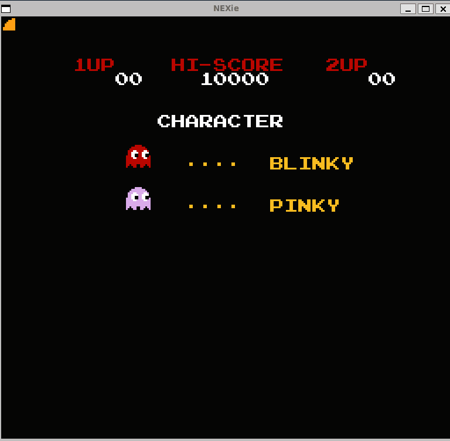

# NEXie(A basic NES Emulator!)
This project was made in Rust and emulates the Nintendo Entertainment System including the CPU(MOS Technology 6502) and PPU.

The CPU has been tested with `nestest` by kevtris and compared against the Nintendulator log(Look in trace.rs to see how the trace is created).

At the moment, the Ricoh 2A03 CPU(based off the MOS 6502 CPU) and most of the PPU is complete. Input and vertical scrolling is complete in this version(tested with Pac-Man and Ice Climbers). Horizontal scrolling and APU(Audio Processing Unit) still needs to be implemented.
## Running the Emulator
To run, look inside `main.rs` and enter the path of the `.nes` file to run. Then, run `cargo run` to run the emulator!

## Input
| Controller Input | Keyboard Input  |
|------------------|-----------------|
| Left             | Left Arrow Key  |
| Right            | Right Arrow Key |
| Up               | Up Arrow Key    |
| Down             | Down Arrow Key  |
| A                | z               |
| B                | x               |
| Start            | Enter           |
| Select           | Space           |
## Pictures/Demos(Tested with Ubuntu 24.04 in WSL)

  
  

